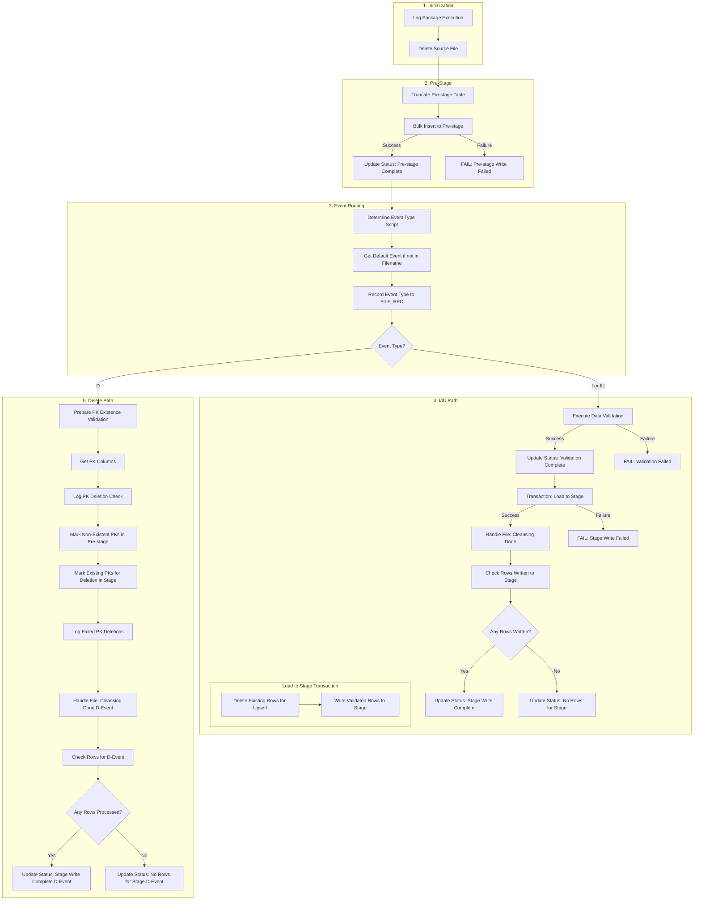

# SSIS Package Spec: Util_ETL_Process

This document specifies the functionality of the `Util_ETL_Process.dtsx` SSIS package.

## 1. Package Overview

- **ObjectName:** Util_ETL_Process
- **CreatorName:** IEAD\1703001
- **CreationDate:** 12/24/2018 9:34:40 AM
- **VersionBuild:** 206

## 2. Logging

- **Log Provider:** SQL Server SSIS Log Provider
- **Configuration:** StagingDB_TW
- **Description:** 將事件的記錄項目寫入 SQL Server 資料庫 (Writes log entries for events to a SQL Server database).

## 3. Package Parameters

This section lists all the parameters defined within the package.

| ObjectName | DataType | Default Value |
| --- | --- | --- |
| `dbPrestageTableName` | String (8) | *empty* |
| `dbSchemaName` | String (8) | `prestage_SAP_EADB` |
| `dbStageTableName` | String (8) | *empty* |
| `dbTableName` | String (8) | `SP02` |
| `etlPackageName` | String (8) | *empty* |
| `param_fileNamePattern` | String (8) | *empty* |
| `param_fileStatusDone` | Integer (3) | `0` |
| `param_fileStatusDoneNoRowsToStageDel` | Integer (3) | `0` |
| `param_fileStatusDoneNoRowToStage` | Integer (3) | `0` |
| `param_fileStatusETLDataVeri` | Integer (3) | `0` |
| `param_fileStatusETLDataVeriFail` | Integer (3) | `0` |
| `param_fileStatusETLPrestage` | Integer (3) | `0` |
| `param_fileStatusETLPrestageFail` | Integer (3) | `0` |
| `param_fileStatusETLStage` | Integer (3) | `0` |
| `param_fileStatusETLStageFail` | Integer (3) | `0` |
| `srcDoneFileFolder` | String (8) | *empty* |
| `srcEkorg` | String (8) | *empty* |
| `srcEncodedFilePath` | String (8) | *empty* |
| `srcErrorFileFolder` | String (8) | *empty* |
| `srcNatName` | String (8) | `TW` |
| `srcOngoingFileFolder` | String (8) | *empty* |
| `srcRawDataFileName` | String (8) | *empty* |
| `srcRawDataFilePath` | String (8) | *empty* |
| `srcSysName` | String (8) | `LMS` |


## 4. Variables

This section lists the variables used within the package.

| Namespace | ObjectName | DataType | EvaluateAsExpression | Expression / Initial Value |
| --- | --- | --- | --- | --- |
| User | `dbLogID` | Integer (3) | False | `0` |
| User | `etlPackageName` | String (8) | True | `@[$Package::srcNatName]+"."+ SUBSTRING( @[$Package::srcSysName], 1, FINDSTRING( @[$Package::srcSysName] ,"_",1) == 0 ? LEN( @[$Package::srcSysName] ) : FINDSTRING( @[$Package::srcSysName] ,"_",1)-1 ) + "."+ @[$Package::dbTableName]+".dtsx"` |
| User | `sqlDefaultEvent` | String (8) | True | `"select case when LEN('" + @[User::writeInEvent] + "') > 0 THEN '" + @[User::writeInEvent] + "' ELSE (SELECT DEF_OP FROM dbo.STAGE_TAB_ACT where NATIONALITY = '"+ @[$Package::srcNatName] +"' and SYS_NAME = '"+ @[$Package::srcSysName] +"' and EKORG = '"+ @[$Package::srcEkorg] +"' and TABLE_NAME = '"+ @[$Package::dbTableName] +"') END "` |
| User | `sqlTruncatePrestage` | String (8) | True | `"truncate table " + @[$Package::dbPrestageTableName]` |
| User | `srcFileStatus` | Integer (3) | False | `0` |
| User | `srcOngoingFilePath` | String (8) | True | `@[$Package::srcOngoingFileFolder]+ @[$Package::srcRawDataFileName]` |
| User | `srcSysNameEkorg` | String (8) | True | `@[$Package::srcSysName] + (LEN( @[$Package::srcEkorg] )>0 ? "_" + @[$Package::srcEkorg] : "")` |
| User | `varlIntoStageRows` | Integer (3) | False | `0` |
| User | `varPKColumns` | String (8) | False | *empty* |
| User | `writeInEvent` | String (8) | False | *empty* |


## 5. Control Flow (Executables &amp; Precedence)

This section describes the control flow of the package, including all executables and their precedence constraints.

### 5.1. Workflow Diagram



### 5.2. Executable Details

---
<a id="A"></a>
#### A. Log Package Execution
- **Original Name:** `紀錄目前檔案執行封裝至dbo sysssislog`
- **Task Type:** ScriptTask
- **Purpose:** To log the start of the process for the specific file.
- **Implementation:**
  ```csharp
  Dts.Log(Dts.Variables["$Package::srcRawDataFileName"].Value.ToString(),999,null);
  ```

---
<a id="B"></a>
#### B. Delete Source File
- **Original Name:** `開始執行資料清洗前，先將根目錄下的資料檔刪除`
- **Task Type:** ExecutePackageTask
- **Purpose:** To clean up the source file from its original location.
- **Implementation:** Calls package `Util_File_IO_Delete.dtsx` with `sourceFilePath` = `$Package::srcRawDataFilePath`.

---
<a id="C"></a>
#### C. Truncate Pre-stage Table
- **Original Name:** `Ttruncate prestage 資料表`
- **Task Type:** ExecuteSQLTask
- **Purpose:** To clear the temporary prestage table before loading new data.
- **Implementation:**
  ```sql
  -- SQL is from variable User::sqlTruncatePrestage
  -- Expression: "truncate table " + @[$Package::dbPrestageTableName]
  ```

---
<a id="D"></a>
#### D. Bulk Insert to Pre-stage
- **Original Name:** `寫入 Prestage (Bulk Insert)`
- **Task Type:** ExecutePackageTask
- **Purpose:** To efficiently load the raw file data into the prestage table.
- **Implementation:** Calls package `Util_ETL_BulkInsertPrestage.dtsx`.

---
<a id="F"></a>
#### F. FAIL: Pre-stage Write Failed
- **Original Name:** `寫入prestage失敗 - 更新檔案狀態並執行檔案工作`
- **Task Type:** ExecutePackageTask
- **Purpose:** Error handling for the bulk insert step.
- **Implementation:** Calls `Util_ETL_Process_Fail.dtsx` to update status and move the file to an error directory.

---
<a id="E"></a>
#### E. Update Status: Pre-stage Complete
- **Original Name:** `【更新檔案狀態】 寫入prestage完成`
- **Task Type:** ExecutePackageTask
- **Purpose:** To mark the file status as ready for the next step (data verification).
- **Implementation:** Calls `Util_File_Status_Change.dtsx`.

---
<a id="G"></a>
#### G. Determine Event Type Script
- **Original Name:** `判斷資料表可執行事件：I or IU or D`
- **Task Type:** ScriptTask
- **Purpose:** To determine the operation type (Insert, Update, Delete) from the filename.
- **Implementation:**
  ```csharp
  string fileName = Dts.Variables["$Package::srcRawDataFileName"].Value.ToString();
  Regex srcRawDataFileRegex = new Regex(rawDataFilePatternStr.ToUpper());
  Match srcRawDataFileMatches = srcRawDataFileRegex.Match(fileName.ToUpper());
  if (srcRawDataFileMatches.Success)
  {
      writeInEvent = srcRawDataFileMatches.Groups[1].ToString();
  }
  Dts.Variables["User::writeInEvent"].Value = writeInEvent;
  ```

---
<a id="H"></a>
#### H. Get Default Event if not in Filename
- **Original Name:** `針對資料檔名不含事件類型的資料表，取得預設執行事件`
- **Task Type:** ExecuteSQLTask
- **Purpose:** If the filename doesn't specify an operation, this task fetches the default operation from a configuration table.
- **Implementation:**
  ```sql
  -- SQL is from variable User::sqlDefaultEvent
  select case when LEN('...') > 0 THEN '...' ELSE (SELECT DEF_OP FROM dbo.STAGE_TAB_ACT where ...)
  ```

---
<a id="I"></a>
#### I. Record Event Type to FILE_REC
- **Original Name:** `將此資料檔執行事件別紀錄至dbo。FILE_REC`
- **Task Type:** ExecuteSQLTask
- **Purpose:** To log the determined operation type for the current file and execution.
- **Implementation:**
  ```sql
  update [dbo].[FILE_REC]
  set FILE_OP = ?
  where [FILE_NAME] = ? and [EXECUTIONID] = ?
  ```

---
<a id="J"></a>
#### J. Execute Data Validation
- **Original Name:** `執行資料驗證`
- **Task Type:** ExecutePackageTask
- **Purpose:** To run a series of data quality and business rule checks on the data in the prestage table.
- **Implementation:** Calls package `VERI_PRESTAGE.dtsx`.

---
<a id="M"></a>
#### M. FAIL: Validation Failed
- **Original Name:** `資料驗證失敗 - 更新檔案狀態並執行檔案工作`
- **Task Type:** ExecutePackageTask
- **Purpose:** Error handling for the validation step.
- **Implementation:** Calls `Util_ETL_Process_Fail.dtsx`.

---
<a id="L"></a>
#### L. Update Status: Validation Complete
- **Original Name:** `【更新檔案狀態】 資料驗證完成`
- **Task Type:** ExecutePackageTask
- **Purpose:** To mark the file status as ready for loading into the final stage table.
- **Implementation:** Calls `Util_File_Status_Change.dtsx`.

---
<a id="N"></a>
#### N. Transaction: Load to Stage
- **Original Name:** `存入Stage之交易(有rollback)`
- **Task Type:** SequenceContainer
- **Purpose:** A transactional sequence for loading data into the stage table. Contains steps N1 and N2.

---
<a id="N1"></a>
##### N1. Delete Existing Rows for Upsert
- **Original Name:** `依PK把資料驗證通過的資料，執行實際Delete，因為即將要被upsert`
- **Task Type:** ExecuteSQLTask
- **Purpose:** (Inside a transaction) To remove existing rows in the final stage table that are about to be replaced (UPSERT logic).
- **Implementation:**
  ```sql
  exec [dbo].[DELETE_STAGE_BEFORE_UPSERT] ?,?,?,?
  ```

---
<a id="N2"></a>
##### N2. Write Validated Rows to Stage
- **Original Name:** `將資料驗證通過的資料列 寫入 stage 資料表`
- **Task Type:** ExecutePackageTask
- **Purpose:** (Inside a transaction) To execute the final data transformation and load from prestage to the stage table.
- **Implementation:** Calls a dynamic package name defined in `User::etlPackageName`.

---
<a id="P"></a>
#### P. FAIL: Stage Write Failed
- **Original Name:** `寫入stage失敗 - 更新檔案狀態並執行檔案工作`
- **Task Type:** ExecutePackageTask
- **Purpose:** Error handling for the final stage load; the transaction will be rolled back.
- **Implementation:** Calls `Util_ETL_Process_Fail.dtsx`.

---
<a id="O"></a>
#### O. Handle File: Cleansing Done
- **Original Name:** `資料清洗完成-資料檔案處理`
- **Task Type:** ExecutePackageTask
- **Purpose:** To move the processed file to the 'Done' folder.
- **Implementation:** Calls `Util_ETL_Process_Done.dtsx`.

---
<a id="Q"></a>
#### Q. Check Rows Written to Stage
- **Original Name:** `資料清洗完成-依寫入Stage資料筆數判斷資料檔案狀態`
- **Task Type:** ExecuteSQLTask
- **Purpose:** To count how many rows were actually loaded into the stage table to decide the final status.
- **Implementation:**
  ```sql
  SELECT ISNULL(ROW_COUNT_REAL,0)-ISNULL(FAIL_AMT,0) AS INTO_STAGE_NO FROM ...
  ```

---
<a id="R"></a>
#### R. Update Status: Stage Write Complete
- **Original Name:** `【更新檔案狀態】 寫入Stage完成`
- **Task Type:** ExecutePackageTask
- **Purpose:** Updates the file status to 'Done' after successfully writing to the stage table.
- **Implementation:** Calls `Util_File_Status_Change.dtsx`.

---
<a id="S"></a>
#### S. Update Status: No Rows for Stage
- **Original Name:** `【更新檔案狀態】 無任一筆資料通過驗證可寫入Stage`
- **Task Type:** ExecutePackageTask
- **Purpose:** Updates the file status when no rows passed validation to be written to the stage.
- **Implementation:** Calls `Util_File_Status_Change.dtsx`.

---
<a id="K"></a>
#### K. Prepare PK Existence Validation
- **Original Name:** `準備VERI_PRESTAGE_ITEM，delete pk是否存在的驗證項目`
- **Task Type:** ExecuteSQLTask
- **Purpose:** For 'Delete' events, this sets up the specific validation rule to check if the PK to be deleted actually exists.
- **Implementation:**
  ```sql
  exec dbo.[NEW_VERI_PRESTAGE_ITEM_DEL_PK] ?,?,?,?,?
  ```

---
<a id="T"></a>
#### T. Get PK Columns
- **Original Name:** `取得PK欄位組合`
- **Task Type:** ExecuteSQLTask
- **Purpose:** To dynamically fetch the primary key column names for the target table from the database schema.
- **Implementation:**
  ```sql
  select STRING_AGG(tmp.COLUMN_NAME,',') from [INFORMATION_SCHEMA].[COLUMNS] ... where c.TABLE_SCHEMA = ? AND c.TABLE_NAME = ?
  ```

---
<a id="U"></a>
#### U. Log PK Deletion Check
- **Original Name:** `在資料表VERI_PRESTAGE_LOG新增一筆delete pk是否存在的檢核紀錄`
- **Task Type:** ExecuteSQLTask
- **Purpose:** To create a log entry for the PK existence check before it runs.
- **Implementation:**
  ```sql
  exec dbo.[NEW_VERI_PRESTAGE_LOG] ?,?,?,?,?,?,?,? output
  ```

---
<a id="V"></a>
#### V. Mark Non-Existent PKs in Pre-stage
- **Original Name:** `將Prestage資料表中，delete pk不存在Stage資料表的紀錄，更新VER_VALUE為128`
- **Task Type:** ExecuteSQLTask
- **Purpose:** To mark rows in prestage for deletion where the corresponding record does NOT exist in the stage table (a failed delete).
- **Implementation:**
  ```sql
  exec dbo.[Verify_PreStage_DeleteEvent] ?,?,?
  ```

---
<a id="W"></a>
#### W. Mark Existing PKs for Deletion in Stage
- **Original Name:** `將Stage資料表中，delete pk存在的紀錄，更新DELETE_MARK 為 1`
- **Task Type:** ExecuteSQLTask
- **Purpose:** To logically mark rows in the final stage table for deletion, based on matching PKs from the prestage table.
- **Implementation:**
  ```sql
  exec Delete_Stage_With_DelMark ?,?,?
  ```

---
<a id="X"></a>
#### X. Log Failed PK Deletions
- **Original Name:** `將delete pk不存在的資料紀錄至VERI_PRESTAGE_LOG_FAIL_DETAIL`
- **Task Type:** ExecuteSQLTask
- **Purpose:** To log the details of the rows that were supposed to be deleted but were not found.
- **Implementation:**
  ```sql
  exec [dbo].[Verify_Prestage_Copy_Fail_Detail_DeletePK] ?,?,?,?,?,?,?
  ```

---
<a id="Y"></a>
#### Y. Handle File: Cleansing Done D-Event
- **Original Name:** `資料清洗完成(事件D)-資料檔案處理`
- **Task Type:** ExecutePackageTask
- **Purpose:** To move the processed file to the 'Done' folder after a 'Delete' event.
- **Implementation:** Calls `Util_ETL_Process_Done.dtsx`.

---
<a id="Z"></a>
#### Z. Check Rows for D-Event
- **Original Name:** `資料清洗完成(事件D)-依寫入Stage資料筆數判斷資料檔案狀態`
- **Task Type:** ExecuteSQLTask
- **Purpose:** To count how many rows were processed for a 'Delete' event to decide the final status.
- **Implementation:**
  ```sql
  SELECT ISNULL(ROW_COUNT_REAL,0)-ISNULL(FAIL_AMT,0) AS INTO_STAGE_NO FROM ...
  ```

---
<a id="AA"></a>
#### AA. Update Status: Stage Write Complete D-Event
- **Original Name:** `【更新檔案狀態(事件D)】 寫入Stage完成`
- **Task Type:** ExecutePackageTask
- **Purpose:** Updates the file status to 'Done' after a 'Delete' event.
- **Implementation:** Calls `Util_File_Status_Change.dtsx`.

---
<a id="BB"></a>
#### BB. Update Status: No Rows for Stage D-Event
- **Original Name:** `【更新檔案狀態(事件D)】 無任一筆資料通過驗證可寫入Stage`
- **Task Type:** ExecutePackageTask
- **Purpose:** Updates the file status when no rows were processed for a 'Delete' event.
- **Implementation:** Calls `Util_File_Status_Change.dtsx`.
